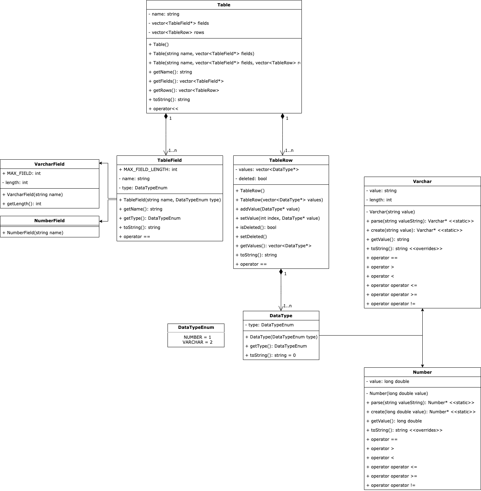

# DB engine

## Структура проекта

`db` - место, где БД хранит таблицы  
`src` - исходный код  
`src/engine` - модуль движка БД  
`src/engine/Config.h` - содержит константы движка(директория для хранения таблиц и т.д.)  
`src/engine/DataTypeEnum.h` - перечисление типов данных, поддерживаемых движком  
`src/engine/DataType.h`  
`src/engine/DataType.cpp` - базовый класс для типа данных БД  
`src/engine/Number.h`  
`src/engine/Number.cpp` - числовой тип данных(включает в себя всевозможные численные типы)  
`src/engine/Varchar.h`  
`src/engine/Varchar.cpp` - строковый тип данных(задается строкой и длиной)  
`src/engine/DataTypeHelper.cpp` - вспомогательное пространство имен, содержащее функции для работы с типами данных  
`src/engine/TableField.h`  
`src/engine/TableField.cpp` - базовый класс для поля таблицы(содержит имя и тип данных)  
`src/engine/NumberField.h`  
`src/engine/NumberField.cpp` - поле таблицы числового типа  
`src/engine/VarcharField.h`  
`src/engine/VarcharField.cpp` - поле таблицы строкового типа  
`src/engine/TableRow.h`  
`src/engine/TableRow.cpp` - строка таблицы(содержит список значений строки и флаг "удален")  
`src/engine/Table.h`  
`src/engine/Table.cpp` - таблица(имя, содержит список полей и строк)  
`src/engine/EngineStatusEnum.h` - перечисление статусов результата работы движка  
`src/engine/EngineStatusStrings.h` - список строк-описаний статусов  
`src/engine/EngineException.h`  
`src/engine/EngineException.cpp` - исключение работы движка  
`src/engine/TableIO.h`  
`src/engine/TableIO.cpp` - пространство имен для работы с вводом/выводом таблицы  
`src/engine/Engine.h`  
`src/engine/Engine.cpp` - основное пространство имен, содержащие интерфейс для взаимодействия с движком  
`src/shared/*` - вспомогательные пространства для работы со строками, векторами и т.д.  

## UML-диаграмма классов

## Интерфейс работы с движком

- `void createTable(Table table)` - создать таблицу `table`(таблица должна содержать имя `name` и список полей `fields`)  
- `Table loadTable(string tableName, bool withRows = false)` - получить содержание таблицы `table`(на выбор - со списком строк или нет)  
- `void insertIntoTable(string tableName, vector<TableRow> rows)` - добавить в таблицу `table` список строк `rows`  
- `void updateValuesInTable(string tableName, vector<TableRow> rows, TableField* field, DataType* value)` - обновить в данном списке строк `rows` таблицы `table` поле `field` новым значением `value`  
- `void deleteFromTable(string table, vector<TableRow> rows)` - удалить из таблицы `table` список строк `rows`  
- `void deleteTable(string table)` - удалить таблицу с именем `table`  

## Автор

Евгений Кислов  
